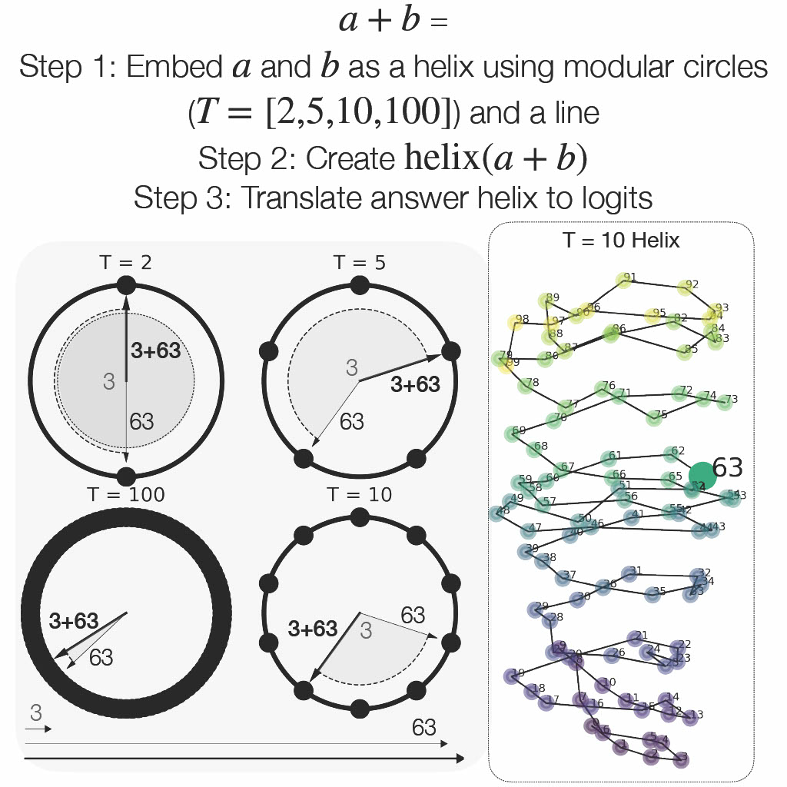

# Language Models Use Trigonometry to Do Addition

<p align="center">
  
</p>

This is the Github repo for the paper "[Language Models Use Trigonometry to Do Addition](https://arxiv.org/abs/2502.00873)." We find that LLMs represent numbers on a helix and manipulate that helix to do addition.

## Reproducing Figures
All figures from the main body of the paper can be reproduced using GPT-J in `paper_figures.ipynb`. For details on the experiments used to generate these figures, please refer to the `experimentation/` directory. Instructions for each specific experiment can be found within `paper_figures.ipynb`.

All required libraries are listed in `requirements.txt`.

There are two pre-generated data folders downloadable on [Dropbox](https://www.dropbox.com/scl/fo/j0rx5kxzb9ucazftdvj0k/AE8wR9HzN5QqgPwE8hOrxKU?rlkey=hiwxmvrh6cbz2tqqqjpisnnel&st=m7egpwlq&dl=0) for reproducing all results in `paper_figures.ipynb`. These include model activations and helical fits.

## Contact and Citation
For questions, please reach out to me at subhashk@mit.edu

For now, please cite this paper as
```
@misc{KantamneniAddition,
Author = {Subhash Kantamneni and Max Tegmark},
Title = {Language Models Use Trigonometry to Do Addition},
Year = {2025},
Eprint = {arXiv:2502.00873},
}
```

